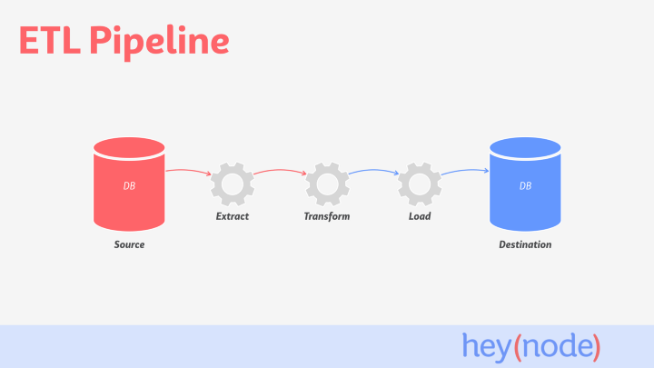
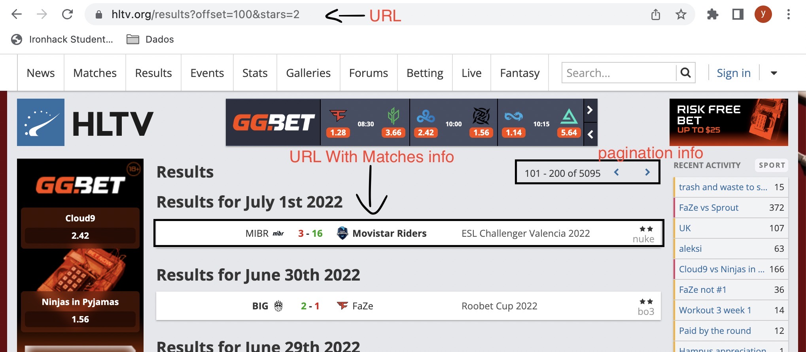
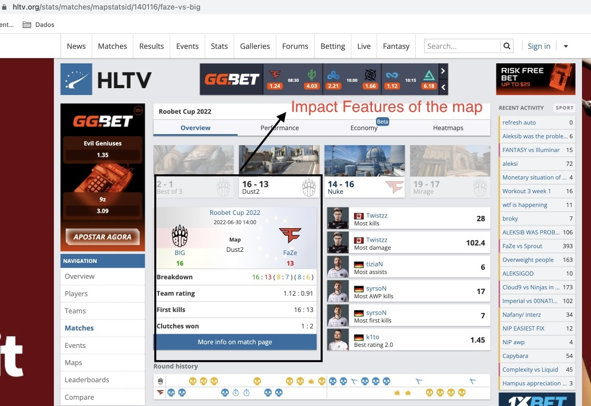
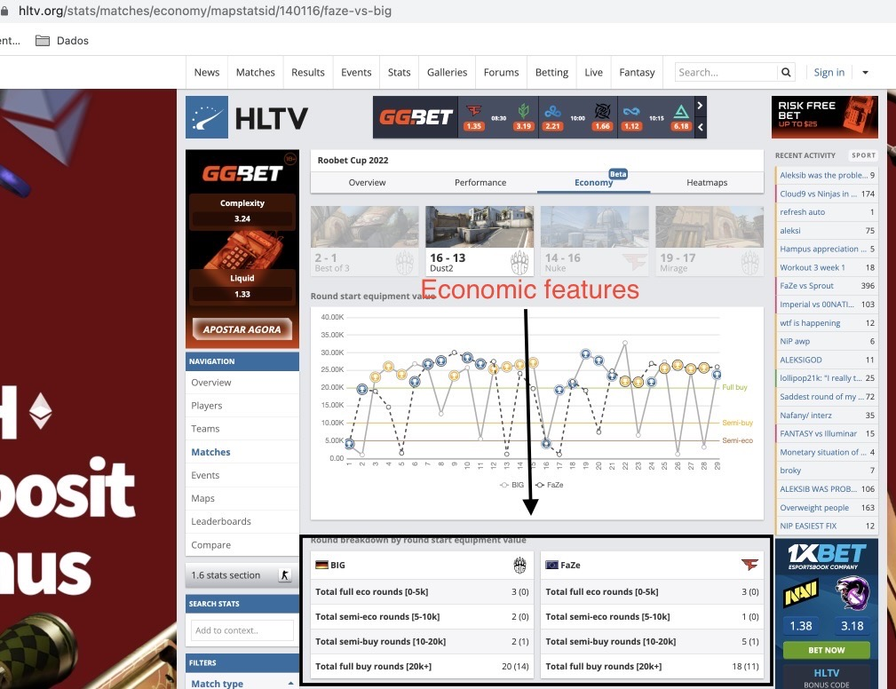
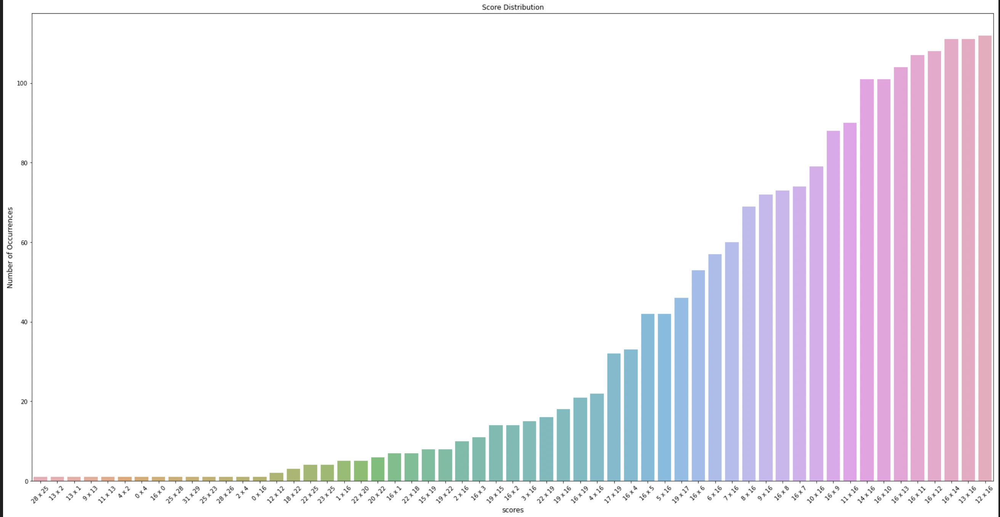
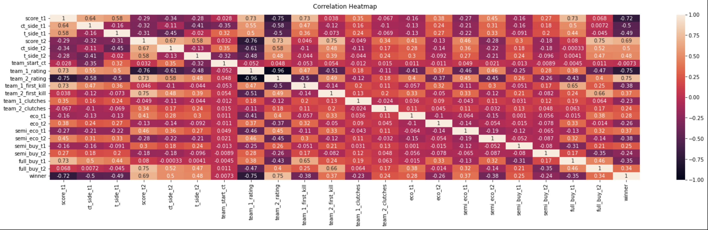
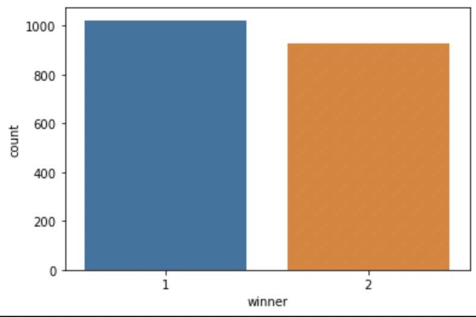
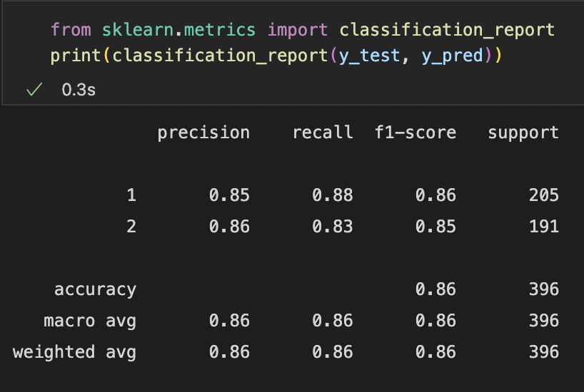
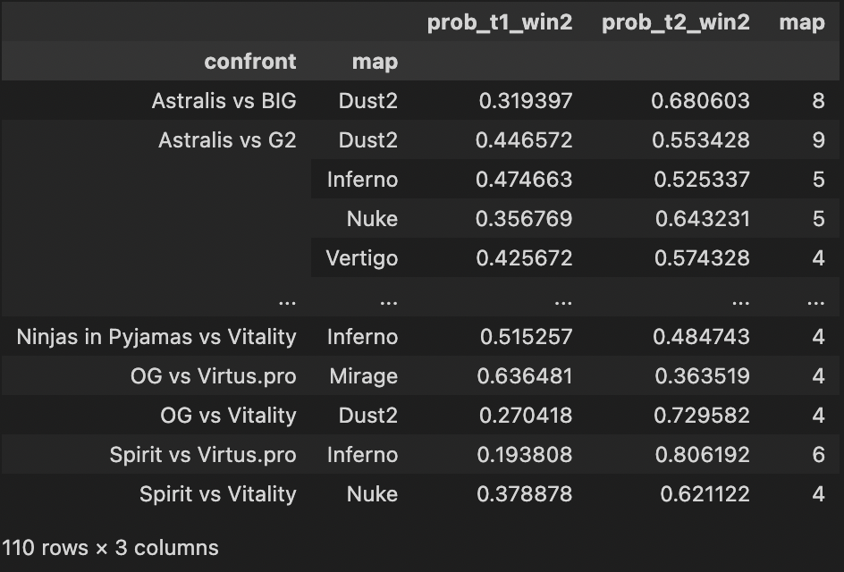

# Counter-Strike_Map_Winner_Prediction_Model

# Project objective

The main goal of this project is to create a model to predict the winner of a Counter-Strike match.

# Methods

Web Scrapping

ETL pipeline

Filtering

Machine Learning

Visualization

# Technologies

Python

MYSQL

Pandas

Sklear
Tableau

# Project Description / Motivation
 
The Esports market size doesn't stop growing over the years. The data show it to us. The global Esports market size was estimated at USD 2,008.4 million in 2021 and is expected to reach USD 2,566.5 million in 2022. Gambling was always a common habit among sports fans, and for esports fans, it is no different, this industry has followed the growing market, and it already took place among fans. With my new data analysis skill, ETL, data analysis, and machine learning techniques let's try to get better luck in our next bet.
# Steps

## ETL Pipeline
 
The project followed pipeline premises to get and store all data; down below, follow the schema where we can better look at how it works.
 

## Source:  Web Scraping
To better understand, let's use some images to help us.

Data Source: HLTV.ORG

First Step: Extract match info links from Hltv.org/results.

The outcome of this result is a list with all the match links.

Second Step: Extract map info detail links from each link grabbed on the first step.

<>image<>

Third Step: Extract relevant info from each map played in the match.

Here on this page, we can find all the impact features of the matches.

Fourth and Final step: Extract economy features from the economy page.

The page reached with the same link on the step above simply adding the word economy in the URL.

 
 
 The outcome until now is a Database shaped 1951 rows and 27 columns.
 
 # Exploratory Data Analisis
 
 With this analysis I want to identify if are there any correlations between the data frame features and the target variable winner.
 
 Score Distribution plot
 
  
 
 Correlation Matrix plot
 
  
 
 Data Frame Ballance
 
  
  
  Those plots above could give to me some insights
  - How competitive the Counter-Strike is.
  - Economic features has a high importance in the game.
  - Impact features such as number of clutches and first kills in the map has a high importance as well.
  - The Data Frame is ballanced, the number of victories of team1 and team 2 it is not too different.
 
 # Model
 
 The model used was GradientBoostingClassifier.
 
 # Model evaluation
 
 As we are looking at the gambling market and the Dataset is well ballanced, I decided to use accuracy as parameter to measure how good is the model.
 
Model classification report

  

 # Results
 
 Compiled results.
 
 Here follow a sample of the final table with probabilities attached to the original DataFrame.
 
 
 
 Observations: 
 (prob_t1_win2 will always be the probabilty of the first team in the confront collumn.
 
 )
 
 
 # Conclusion
 
 
