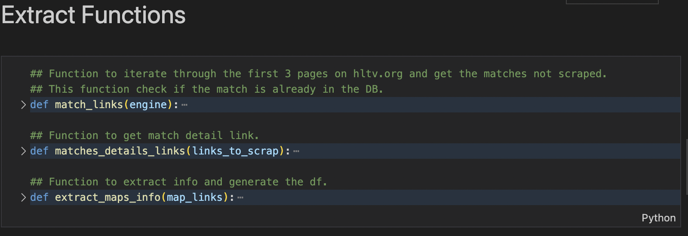
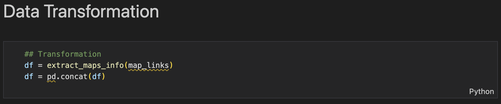
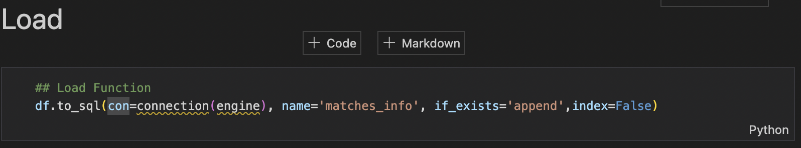
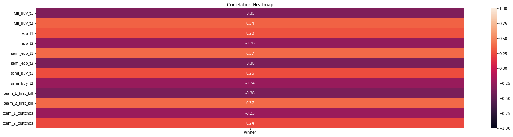
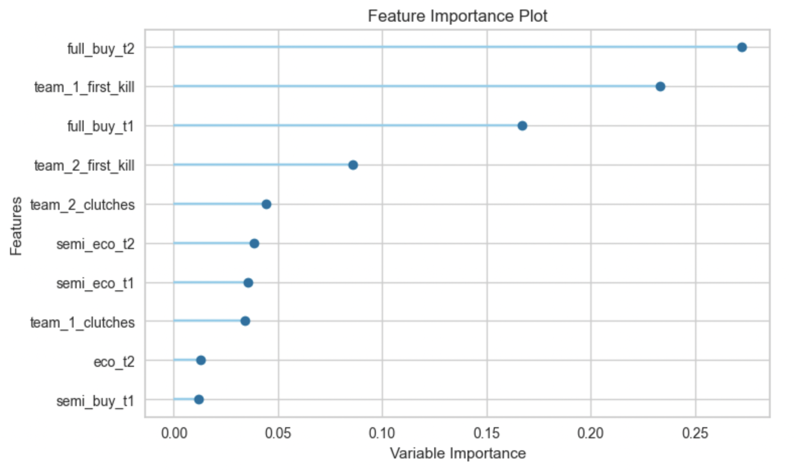

# Counter-Strike_Map_Winner_Prediction_Model

Project status: in progress

# Project objective

The main goal of this project is to create a model to predict the winner of a Counter-Strike match.

# Methods

Web Scrapping

ETL pipeline

Filtering

Machine Learn

Visualization

# Technologies

Python

MYSQL

Pandas

Sklearn

Tableau

# Project Description / Motivation
 
The Esports market size doesn't stop growing over the years. The data show it to us. The global Esports market size was estimated at USD 2,008.4 million in 2021 and is expected to reach USD 2,566.5 million in 2022. Gambling was always a common habit among sports fans, and for esports fans, it is no different, this industry has followed the growing market, and it already took place among fans. With my new data analysis skill and machine learning techniques let's try to get better luck in our next bet.
# Steps

## ETL Pipeline
 
The project followed pipeline premises to get and store all data; down below, follow the schema where we can better look at how it works.
 

### Source:  Web Scraping
To better understand, let's use some images to help us.

Data Source: HLTV.ORG

First Step: Extract match info links from Hltv.org/results.

The outcome of this result is a list with all the match links.

Second Step: Extract map info detail links from each link grabbed on the first step.

<>image<>

Third Step: Extract relevant info from each map played in the match.

Here on this page, we can find all the impact features of the matches.

Fourth and Final step: Extract economy features from the economy page.

The page reached with the same link on the step above simply adding the word economy in the URL.

 
 
### Extraction functions

 

### Transform function

 

### Load function

# Automating the data pipeline

Scheduler tool Cron

# Exploratory Data Analisis
 
 With this analysis I want to identify if there are any correlations between the data frame features and the target variable winner.
 
 Score Distribution plot
 
  
 
 Correlation Matrix plot
 
  
 
 Data Frame Ballance
 
  
  
These graphs above gave me some insights
 
  - How competitive is Counter-Strike.
  - Economic characteristics are of great importance in the game.
  - Impact features such as number of clutches and first kills on the map are also of great importance.
  - The Data Frame is balanced, the number of wins of team 1 and team 2 is not much different.
 
 # Model
 
 The model used was GradientBoostingClassifier.
 
 # Model evaluation
 
 As we are looking at the gambling market and the Dataset is well ballanced, I decided to use accuracy as parameter to measure how good is the model.
 
Model classification report

  
  
Feature importance plot

 # Results
 
 Compiled results.
 
 Here follow a sample of the final table with probabilities attached to the original DataFrame.
 
 
 
 Observations: 

(column prob_t1_win2 will always be the probability of the first team in the confront column)
 

To understand better I also created a graphic with some interactivity to facilitate the user experience. You can find it here:
 You can find it here: https://public.tableau.com/app/profile/yuri.velkis/viz/Counter-Strike_final_chart/ModelChart?publish=yes
 
 # Conclusion
 
Since our dataset is still receiving data from the data pipeline, I still haven't been able to draw any meaningful conclusions about the model..
